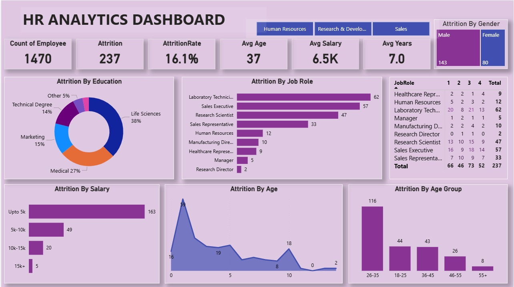

# HR Analytics Dashboard

## 📊 Project Overview
The HR Analytics Dashboard provides insights into employee attrition, workforce demographics, salary distribution, and job role analysis.  
The objective of this project is to analyze employee turnover patterns and help HR teams make data-driven decisions to reduce attrition.

---

## 🖼️ Dashboard Screenshot

---

## 📌 Key Metrics (Top KPIs)

- *Total Employees:* 1470  
- *Total Attrition:* 237  
- *Attrition Rate:* 16.1%  
- *Average Age:* 37 Years  
- *Average Salary:* 6.5K  
- *Average Years at Company:* 7.0 Years  

These KPIs provide a quick overview of workforce health and employee turnover.

---

## 📈 Charts & Insights Explanation

### 1️⃣ Attrition by Education
- Highest attrition comes from *Life Sciences (38%)*
- Followed by *Medical (27%)*
- Technical Degree (14%), Marketing (15%), Other (5%)

📌 Insight: Employees from Life Sciences background show higher turnover.

---

### 2️⃣ Attrition by Job Role
- Laboratory Technician – 62
- Sales Executive – 57
- Research Scientist – 47
- Sales Representative – 33
- Human Resources – 12
- Manufacturing Director – 10
- Healthcare Representative – 9
- Manager – 5
- Research Director – 2

📌 Insight: Technical and Sales roles have the highest attrition.

---

### 3️⃣ Attrition by Salary
- Up to 5K – 163 employees
- 5K–10K – 49 employees
- 10K–15K – 20 employees
- 15K+ – 5 employees

📌 Insight: Majority attrition occurs in lower salary bands.

---

### 4️⃣ Attrition by Age
The line/area chart shows that attrition is highest among younger employees, especially around early career stages.

📌 Insight: Early-career employees are more likely to leave.

---

### 5️⃣ Attrition by Age Group
- 26–35 → 116 (Highest)
- 18–25 → 44
- 36–45 → 43
- 46–55 → 26
- 55+ → 8

📌 Insight: Employees aged 26–35 show the highest turnover.

---

### 6️⃣ Attrition by Gender
- Male – 143
- Female – 80

📌 Insight: Attrition is higher among male employees.

---

### 7️⃣ Department Filter
The dashboard includes department filters:
- Human Resources
- Research & Development
- Sales

This allows dynamic analysis by department.

---

## 🛠️ Tools Used
- Power BI
- Data Modeling
- DAX Measures
- Data Cleaning & Transformation

---

## 🎯 Project Outcome
- Identified high attrition in lower salary bands.
- Found 26–35 age group most impacted.
- Sales and Laboratory roles show higher turnover.
- Dashboard enables HR teams to monitor workforce trends efficiently.

---

## 📂 Files Included
- HR Analytics Dashboard (.pbix)
- Dataset File
- Dashboard Screenshot (Dashboard_Screenshot.png)

---
## 📌 Conclusion
This HR Analytics Dashboard helps organizations understand attrition patterns based on age, salary, education, job role, and gender.  
It supports strategic HR planning and employee retention improvement.
